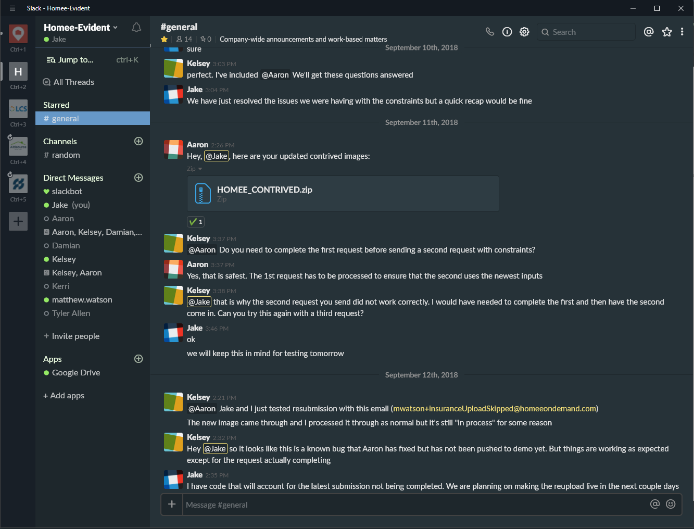

#Material Oceanic for Slack


navigate to:  
unix: /usr/lib/slack/resources/app.asar.unpacked/src/static/  
win : C:\Users\<User>\AppData\Local\slack\app-<version>\resources\app.asar.unpacked/src/static/  

append the following to the end of ssb-interop.js:

```
document.addEventListener('DOMContentLoaded', function() {
 $.ajax({
   url: 'https://raw.githack.com/jakeneels/SlackMaterialOceanic/master/materialOceanic.css',
   success: function(css) {
     $("<style></style>").appendTo('head').html(css);
   }
 });
});
```
restart the slack client   
optional select preferences>sidebar>Theme>Ochin in slack for material colored sidebar  
#####IMPORTANT! You should host your own url to prevent an XSS attack on your Slack client!
